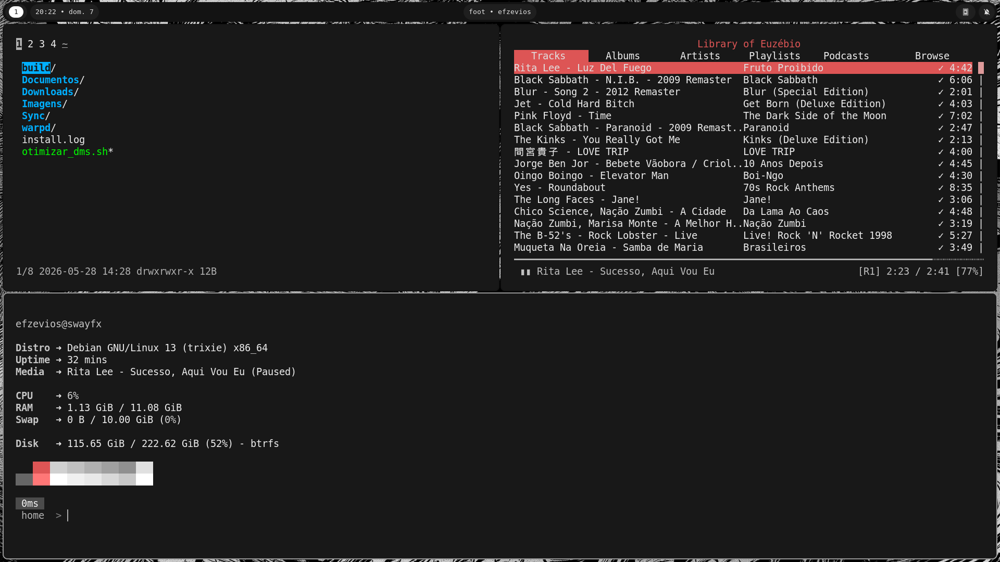
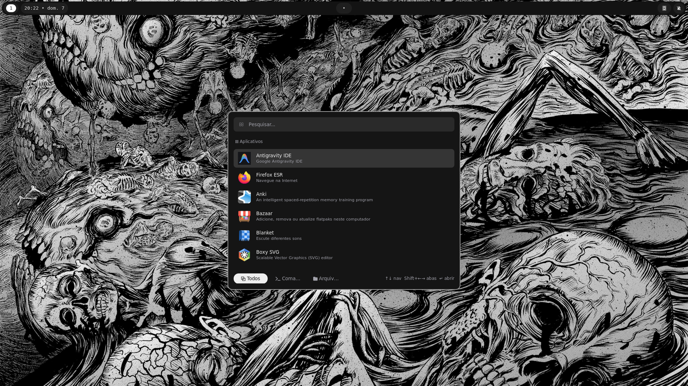
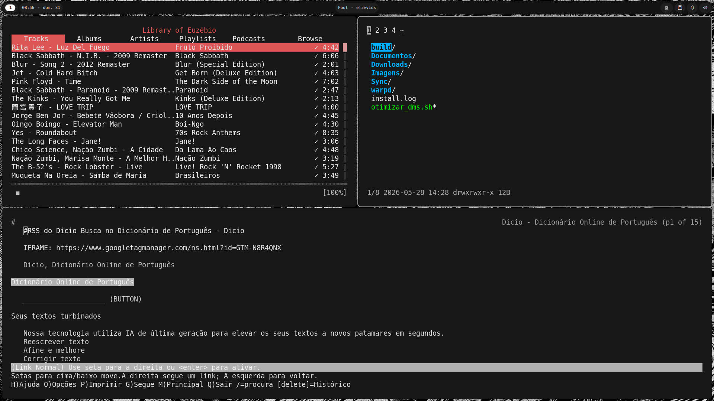
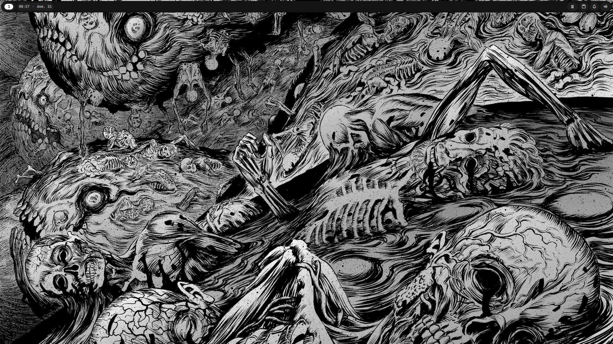
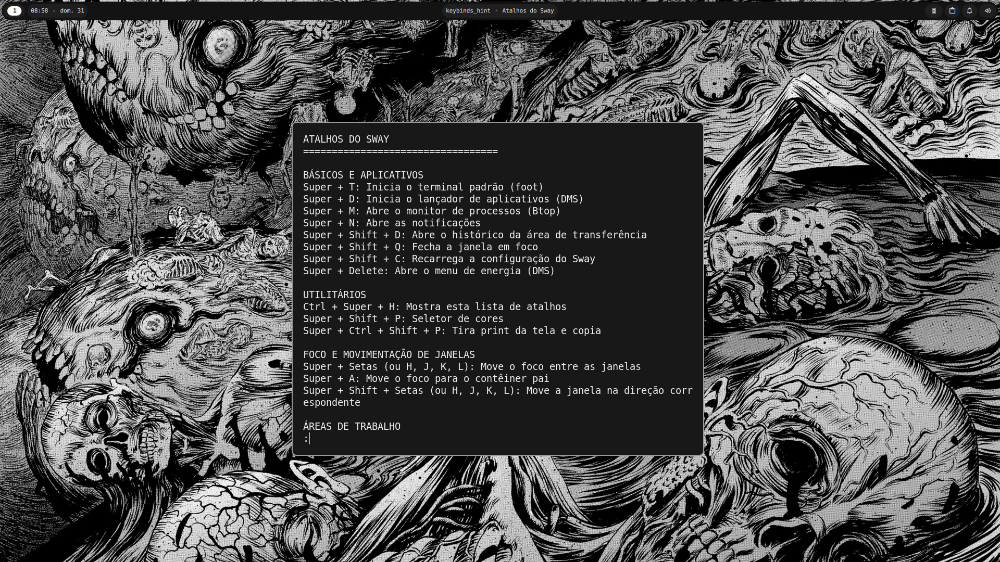

# Meu Rice do Sway

Este repositório contém minhas configurações e scripts pessoais do Sway (dotfiles).

## 📸 Capturas de Tela

### Espaço de trabalho atual

<div align="center">
  
  
  
</div>

### Espaço de trabalho com DMS SHELL

<div align="center">
  
  
  
</div>

## 📦 Conteúdo Atual

*   **Gerenciador de Janelas:** [Sway](https://swaywm.org/)
*   **Barra:** [Waybar](https://github.com/Alexays/Waybar)
*   **Terminal:** [foot](https://codeberg.org/dnkl/foot)
*   **Menu / Lançador de Aplicativos:** [Rofi Wayland](https://github.com/lbonn/rofi) *(substituiu o DMS e o Wofi)*
*   **Prompt (Terminal):** [Oh My Posh](https://ohmyposh.dev/)
*   **Informações do Sistema:** [Fastfetch](https://github.com/fastfetch-cli/fastfetch)
*   **Controle do Mouse via Teclado:** [warpd](https://github.com/rvaiya/warpd)

*(Componentes como DM e Wofi não são mais utilizados no setup atual. Seus arquivos foram mantidos nas pastas `antigos/` caso queira acessá-los.)*

## 🚀 Instalação

1.  Clone este repositório:
    ```bash
    git clone https://github.com/efzevios/Sway.git
    cd Sway
    ```

2.  Copie os arquivos de configuração atuais para o seu diretório `~/.config` (ignorando a pasta de antigos, se quiser):
    ```bash
    cp -r .config/* ~/.config/
    ```

3.  Copie os scripts do lançador Rofi para o seu diretório `.local/bin` (necessário para o "Abrir com..." e o lançador principal):
    ```bash
    mkdir -p ~/.local/bin
    cp -r .local/bin/* ~/.local/bin/
    chmod +x ~/.local/bin/*
    ```

4.  Copie os arquivos `.bashrc` e `.profile` para a sua pasta de usuário (faça um backup dos seus originais primeiro!):
    ```bash
    cp .bashrc ~/.bashrc
    cp .profile ~/.profile
    ```

## 🖼️ Papel de Parede

O papel de parede está localizado em `.config/background-d.jpg`. Ele será carregado automaticamente pela configuração do Sway, que espera encontrá-lo em `~/.config/background-d.jpg`.

## ⚙️ Scripts

Os scripts do sistema foram reorganizados para facilitar o uso:

*   **`Scripts/atuais/`**: Contém os scripts em uso hoje no setup. Abaixo, uma explicação de cada um:
    *   `ativar-serviços.sh`: Ativa serviços essenciais em modo usuário (como o Syncthing).
    *   `audio.sh`: Configura o WirePlumber para corrigir problemas de áudio (como travamentos e volume baixo).
    *   `cubesuite.sh`: Gerencia a inicialização ou configuração do Cubesuite.
    *   `fix_kdeconnect_sway.sh`: Resolve problemas de compatibilidade do KDE Connect no Sway.
    *   `instalar_dependencias_rice.sh`: Baixa e instala dependências vitais como o Rofi-Wayland, Fontes Inter e Nerd Fonts.
    *   `instalar_kdeconnect.sh`: Instala e prepara o KDE Connect para uso com o SwayFX.
    *   `open-tablet-driver.sh`: Configura e inicia o OpenTabletDriver.
    *   `setup_cliphist.sh`: Instala e configura o gerenciador de área de transferência Cliphist.
    *   `setup-timeshift.sh`: Realiza a configuração inicial do Timeshift para backups do sistema.
    *   `swayfx.sh`: Gerencia configurações ou dependências relacionadas ao SwayFX.
*   **`Scripts/antigos/`**: Contém scripts antigos, guardados apenas como histórico e referência.

## 🤝 Projetos Complementares

Abaixo estão alguns projetos incríveis que recomendo e que complementam perfeitamente este rice:

*   **[LinuxToys](https://github.com/psygreg/linuxtoys)**
*   **[tgpt](https://github.com/aandrew-me/tgpt)**
*   **[Spicetify](https://spicetify.app/)**
*   **[tldr](https://tldr.sh/)**
*   **[Tela circle icon](https://github.com/vinceliuice/Tela-circle-icon-theme)**
*   **[Orchis theme](https://github.com/vinceliuice/Orchis-theme)**

---

*Nota: Lembre-se de revisar os arquivos de configuração para adaptá-los ao seu hardware específico, como nomes de monitores e resoluções no arquivo de configuração do Sway.*
